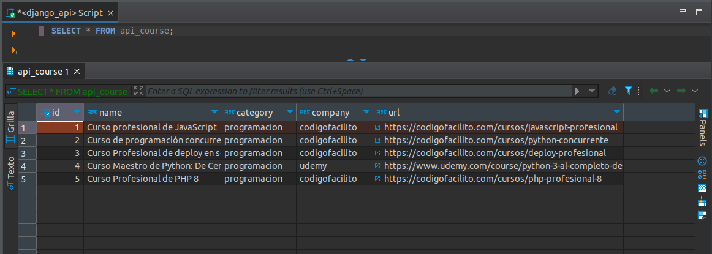
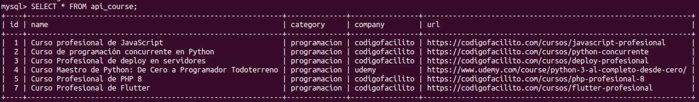
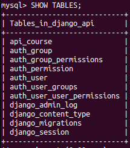

# rest-api-django

## Run
```bash
python3 manage.py runserver
```

### First time
```bash 
python3 manage.py migrate
```

```bash 
python3 manage.py createsuperuser
```

```bash 
python3 manage.py migrate
```

```bash 
python3 manage.py runserver
```


## Data base's table example
#### Courses:

<br><br>

#### Django's tables:<br>
<br><br><br>

## Endpoint examples

GET list_courses
```json
{
  "status": "success",
  "message": "Success",
  "courses": [
    {
      "id": 1,
      "name": "Curso profesional de JavaScript",
      "category": "programacion",
      "company": "codigofacilito",
      "url": "https://codigofacilito.com/cursos/javascript-profesional"
    },
    {
      "id": 2,
      "name": "Curso de programación concurrente en Python",
      "category": "programacion",
      "company": "codigofacilito",
      "url": "https://codigofacilito.com/cursos/python-concurrente"
    },
    {
      "id": 3,
      "name": "Curso Profesional de deploy en servidores",
      "category": "programacion",
      "company": "codigofacilito",
      "url": "https://codigofacilito.com/cursos/deploy-profesional"
    },
    {
      "id": 4,
      "name": "Curso Maestro de Python: De Cero a Programador Todoterreno",
      "category": "programacion",
      "company": "udemy",
      "url": "https://www.udemy.com/course/python-3-al-completo-desde-cero/"
    },
    {
      "id": 5,
      "name": "Curso Profesional de PHP 8",
      "category": "programacion",
      "company": "codigofacilito",
      "url": "https://codigofacilito.com/cursos/php-profesional-8"
    }
  ]
}
```

GET read_course
```json
{
  "status": "success",
  "message": "Success",
  "course": {
    "id": 2,
    "name": "Curso de programación concurrente en Python",
    "category": "programacion",
    "company": "codigofacilito",
    "url": "https://codigofacilito.com/cursos/python-concurrente"
  }
}
```

POST add_course
```json
{
  "status": "success",
  "message": "Course added"
}
```

PUT update_course
```json
{
  "status": "success",
  "message": "Course updated"
}
```

DELETE delete_course
```json
{
  "status": "success",
  "message": "Course deleted"
}
```